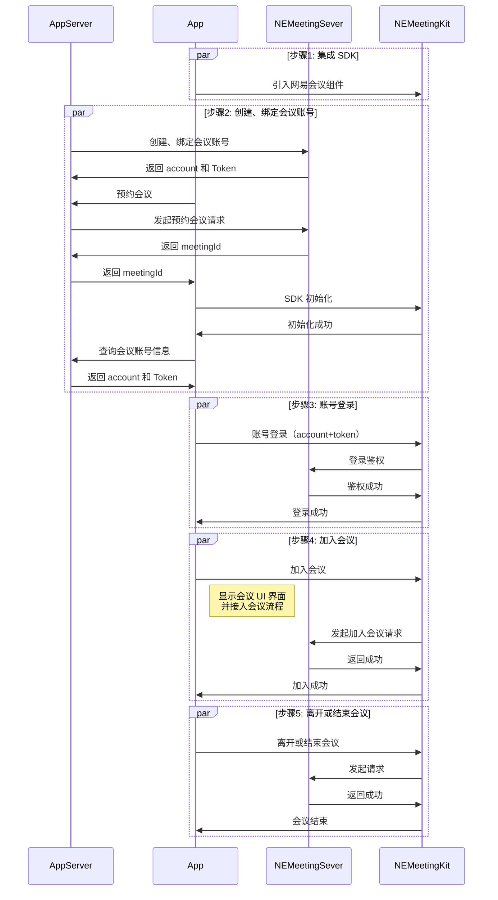

本系列文档介绍如何通过网易会议组件 NEMeetingKit 提供的一套简单易用的接口，快速地将音视频会议基础功能集成至现有安卓应用中。

## 前提条件

在使用网易会议组件之前，请确保您已经完成了以下操作：

- [集成并初始化 SDK](https://doc.yunxin.163.com/meeting/guide/DQzOTU2NzQ?platform=web)
- [登录鉴权](https://doc.yunxin.163.com/meeting/guide/DM0OTEwMjQ)

## 服务概述

NEMeetingKit 提供了多个服务接口来实现完整的会议功能：

**NEAccountService**：提供登录登出、查询账号信息等接口。

**NEMeetingService**：提供开始会议、加入会议、离开会议等接口。请注意：会中及会控相关能力均以完整 UI 形式提供。调用 "开始会议" 或 "加入会议" 后将直接进入会中界面，音视频开关、屏幕共享、参会者管理、邀请成员、移除成员等操作均需通过 UI 交互完成。NEMeeting SDK 不提供对应的底层接口，会中 UI 界面也不支持直接修改。如需扩展业务逻辑，可通过注入底部菜单项、添加小应用等方式进行集成。

**NESettingsService**：提供会议设置服务，可设置入会时、会议中的一些配置信息，如入会时的音视频开关选项、虚拟背景、美颜、语音激励等功能的配置。

**NEPreMeetingService**：提供会议预约服务，包括预约会议、取消预约、查询预约、获取历史会议等功能。

**NEMeetingInviteService**：提供邀请相关的服务接口，包括接受邀请、拒绝邀请、邀请联系人加入会议等功能。

**NEMeetingMessageChannelService**：提供会议消息通知相关的服务接口，诸如查询自定义消息历史、查询未读数、添加消息监听等功能。

**NEContactsService**：提供账号通讯录相关的能力，可以获取到通讯录成员及其详细信息。

**NEFeedbackService**：提供意见反馈能力，包括意见反馈界面入口和意见反馈接口。

**NEMeetingRealtimeRecorderService**：提供实时记录界面相关的服务接口，诸如秒录开启/停止状态监听等功能。

**NEMeetingWebAppService**：提供会中小应用服务，包括获取小应用列表、开启小应用功能、关闭小应用功能等接口。

## API 时序

下图展示了使用 NEMeetingKit 实现在线会议的主要流程，其中预约会议步骤是可选的，您也可以直接创建即时会议：

更多详情，请参考 [客户端 API 文档](https://doc.yunxin.163.com/meetingkit/references/web/typedoc/Latest/zh/modules.html)。

<!-- 
## 集成说明

- **集成顺序**：
   - 必须先完成 SDK 集成、初始化和登录鉴权，才能进行后续操作。
   - 预约会议步骤是可选的，您也可以直接创建即时会议。

- **账号信息**：
   - account 是用户在网易会议系统中的唯一标识
   - token 是用于鉴权的凭证，有效期有限，过期需要重新获取

- **关于会议ID**：
   - meetingId 是会议的唯一标识符
   - 即时会议和预约会议都会生成唯一的 meetingId

- **会议操作**：
   - 会议创建者可以结束会议（所有人退出）
   - 普通参会者只能离开会议（自己退出） -->